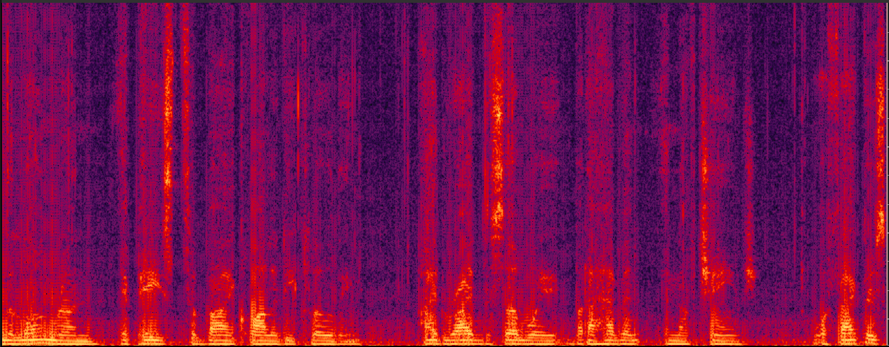
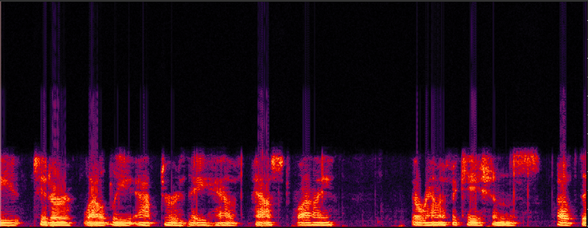
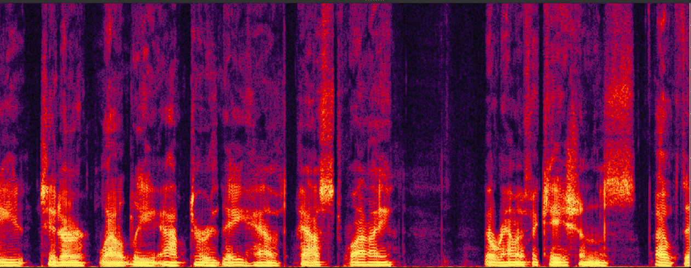
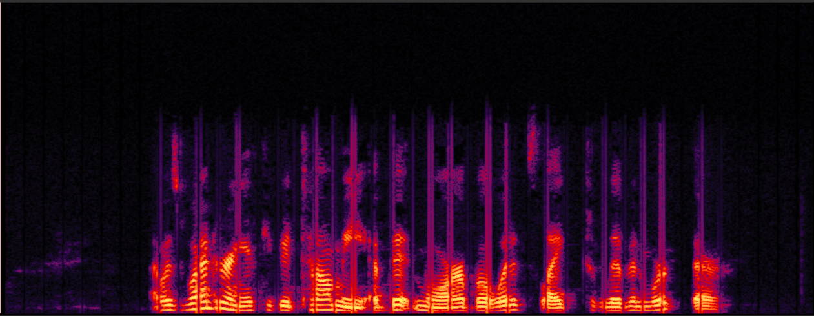
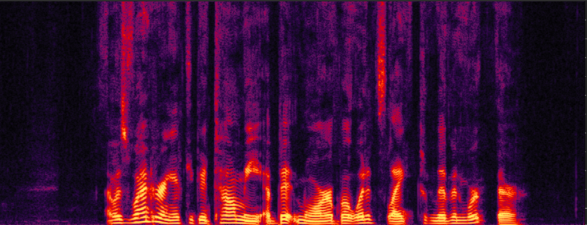
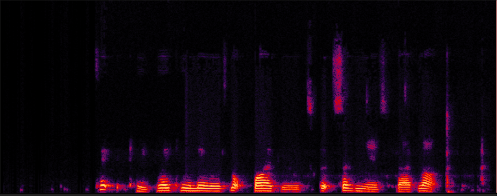
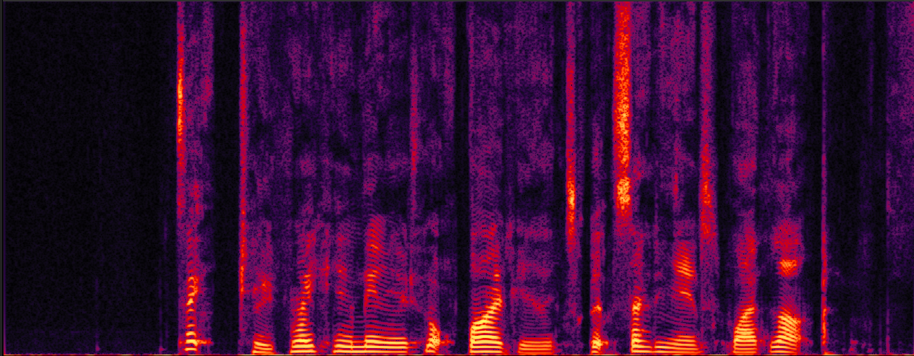
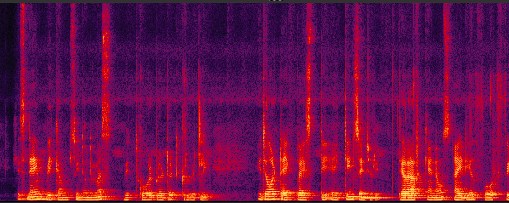
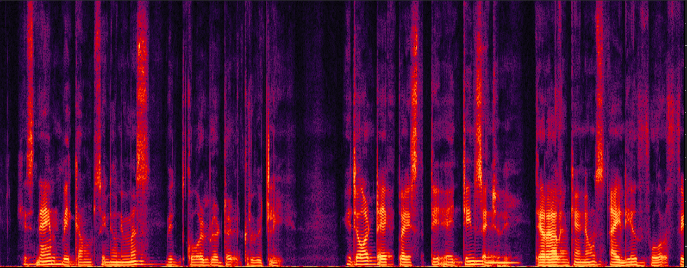

<div align="center">

# Universal Speech Enhancement

<a href="https://pytorch.org/get-started/locally/"></a>
<a href="https://pytorchlightning.ai/"></a>
<a href="https://hydra.cc/"></a>
<a href="https://github.com/ashleve/lightning-hydra-template"></a><br>

</div>

## Features

- Improving speech signals recorded under various distortion conditions to approximate studio-quality audio
- One model for all monaural speech enhancement tasks: noise suppression, dereverberation, equalization, packet loss concealment, bandwidth extension, declipping, and others
- Score diffusion-based and GAN-based approaches for training and inference
- Easy-to-use interface
- 24kHz sampling rate pipeline

## Demo Samples

<table>
  <tr>
    <th>Original</th>
    <th>Enhanced</th>
  </tr>
  <tr>
    <td>
      
      <br>
      <audio controls>
        <source src="Resources/sqe_original.wav" type="audio/wav">
        Your browser does not support the audio element.
      </audio>
    </td>
    <td>
      
      <br>
      <audio controls>
        <source src="Resources/sqe_SGMSE_GAN.wav" type="audio/wav">
        Your browser does not support the audio element.
      </audio>
    </td>
  </tr>
  <tr>
    <td>
      
      <br>
      <audio controls>
        <source src="Resources/hybrid_3_original.wav" type="audio/wav">
        Your browser does not support the audio element.
      </audio>
    </td>
    <td>
      
      <br>
      <audio controls>
        <source src="Resources/hybrid_3_SGMSE_GAN.wav" type="audio/wav">
        Your browser does not support the audio element.
      </audio>
    </td>
  </tr>
  <tr>
    <td>
      
      <br>
      <audio controls>
        <source src="Resources/hybrid_2_original.wav" type="audio/wav">
        Your browser does not support the audio element.
      </audio>
    </td>
    <td>
      
      <br>
      <audio controls>
        <source src="Resources/hybrid_2_SGMSE_GAN.wav" type="audio/wav">
        Your browser does not support the audio element.
      </audio>
    </td>
  </tr>
  <tr>
    <td>
      
      <br>
      <audio controls>
        <source src="Resources/hybrid_4_original.wav" type="audio/wav">
        Your browser does not support the audio element.
      </audio>
    </td>
    <td>
      
      <br>
      <audio controls>
        <source src="Resources/hybrid_4_SGMSE_GAN.wav" type="audio/wav">
        Your browser does not support the audio element.
      </audio>
    </td>
  </tr>
  <tr>
    <td>
      
      <br>
      <audio controls>
        <source src="Resources/drb_original.wav" type="audio/wav">
        Your browser does not support the audio element.
      </audio>
    </td>
    <td>
      
      <br>
      <audio controls>
        <source src="Resources/drb_SGMSE_GAN.wav" type="audio/wav">
        Your browser does not support the audio element.
      </audio>
    </td>
  </tr>
</table>

## Demo Video

[Watch on Bilibili](https://www.bilibili.com/video/BV1ojvceCEMk/?spm_id_from=333.999.0.0)

## Demo Page

[Universal Speech Enhancement Demo](https://nanless.github.io/universal-speech-enhancement-demo)

More demo samples available in the demo page. It may take a few seconds to load the audio and image files in the demo page.

## Description

This repository contains the code for training and inference of the universal speech enhancement model using GAN-based and score diffusion-based approaches. 

Universal speech enhancement aims to improve speech signals recorded under various adverse conditions and distortions, including noise, reverberation, clipping, equalization (EQ) distortion, packet loss, codec loss, bandwidth limitations, and other forms of degradation. A comprehensive universal speech enhancement system integrates multiple techniques such as noise suppression, dereverberation, equalization, packet loss concealment, bandwidth extension, declipping, and other enhancement methods to produce speech signals that closely approximate studio-quality audio.

The models are trained on clean speech from the [EARS dataset](https://github.com/facebookresearch/ears_dataset.git) and noise signals from the [DNS5 dataset](https://github.com/microsoft/DNS-Challenge.git). The sampling rate used in the project is 24 kHz. Input audio will be resampled to 24 kHz before processing, and the output audio remains at 24 kHz.

## To-do List
- [ ] Add automatic volume control
- [ ] Expand training data to improve model performance
- [ ] Apply GAN-based model as initialization for score diffusion-based model to improve stability and performance
- [ ] Support 48kHz sampling rate pipeline

## Installation

### Pip

```bash
# install pytorch (I use rocm for GPU training, but you can use CUDA if you have it)
pip install torch==2.3.0 torchvision==0.18.0 torchaudio==2.3.0 --index-url https://download.pytorch.org/whl/rocm6.0
# install requirements
pip install -r requirements.txt

```

## How to run

### Training

Train model with chosen experiment configuration from [configs/experiment/](configs/experiment/)

```bash
python src/train.py experiment=SGMSE_Large
```

### Inference

Predict with trained model

Download the pretrained SGMSE model: https://huggingface.co/nanless/universal-speech-enhancement-SGMSE/blob/main/use_SGMSE.ckpt

Download the pretrain LSGAN model: https://huggingface.co/nanless/universal-speech-enhancement-LSGAN/blob/main/use_LSGAN.ckpt


```bash
# predict with SGMSE model
python src/predict.py data.data_folder=<path/to/test/folder> data.target_folder=<path/to/output/folder> model=SGMSE_Large ckpt_path=<path/to/trained/model>
# refine with LSGAN model
python src/predict.py data.data_folder=<path/to/SGMEE/output/folder> data.target_folder=<path/to/output/folder> model=LSGAN ckpt_path=<path/to/trained/model>
```

## References

This repository is developed based on the following repositories.

https://github.com/sp-uhh/sgmse

https://github.com/facebookresearch/ears_dataset

https://github.com/microsoft/DNS-Challenge

https://github.com/ashleve/lightning-hydra-template

